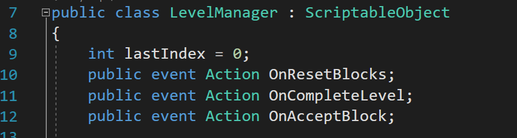
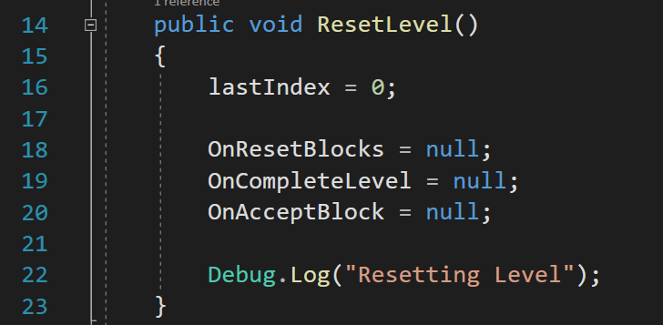
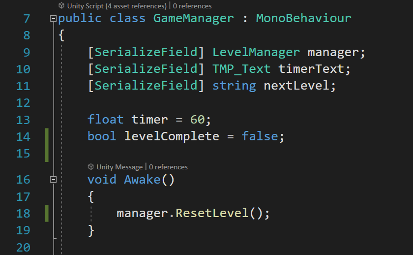
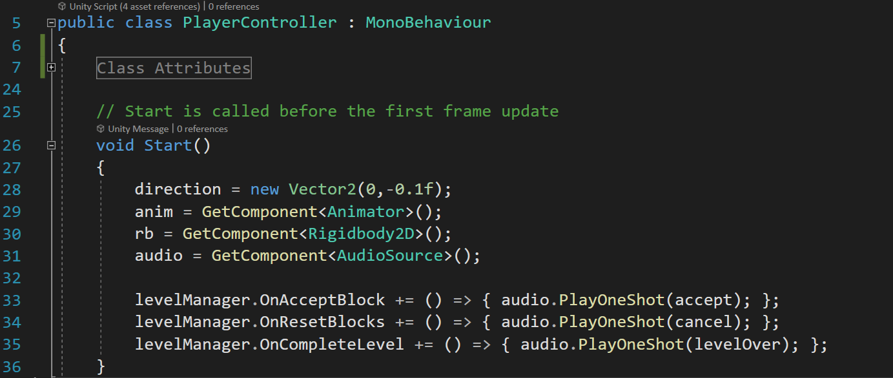
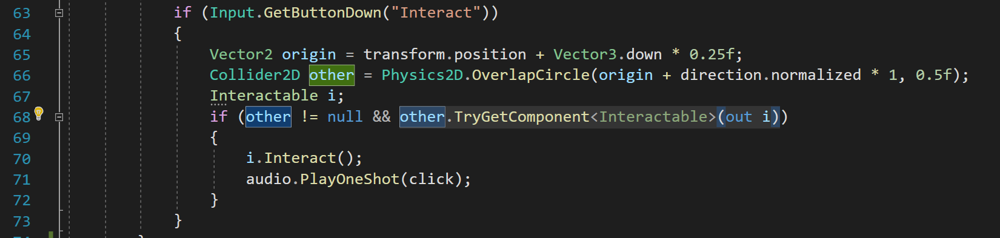
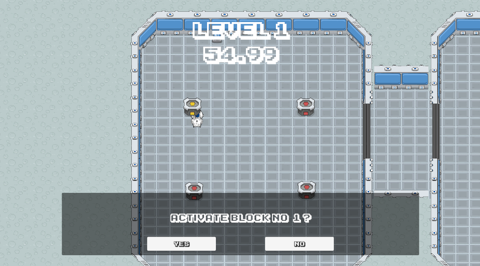
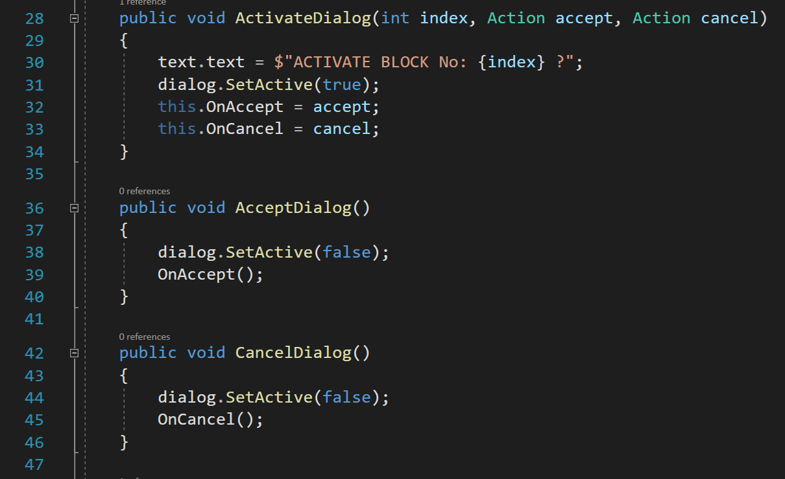
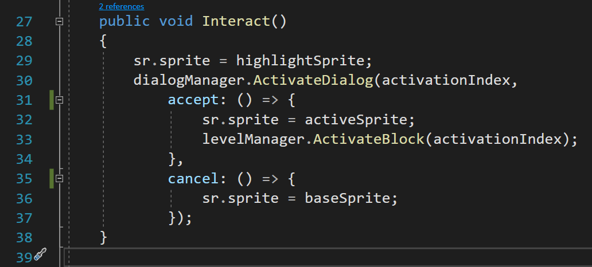
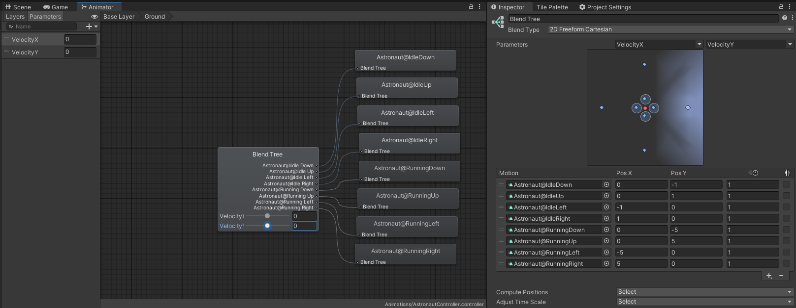
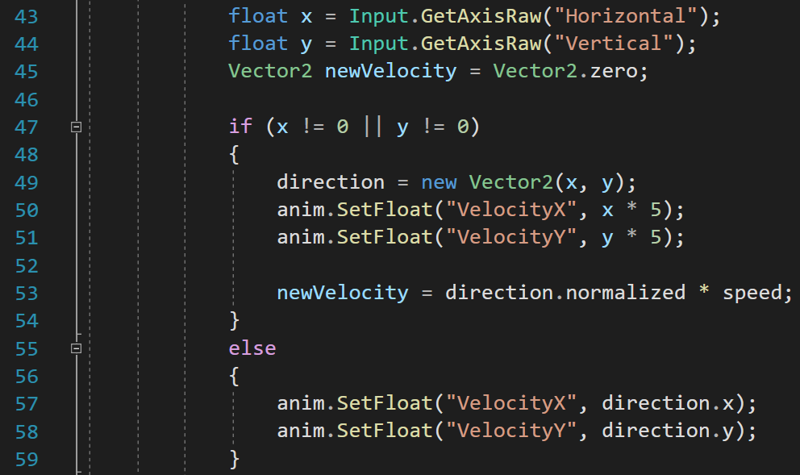

# Astrotime
Actividad 3 del curso Desarrollo de Videojuegos 1

Elaborado por: Rodolfo Mora-Zamora.

## Descripción del juego

- **Género:** Top-Down Action Adventure
- **Engine:** Unity 3D 2022.3.27f1
- **Disponible en:** https://ceibasoft.itch.io/astrotime?secret=jOqUSn0RZGRG0mXkjXX0UvlczqA
- **Código disponible en:** https://github.com/Rjmoraza/astrotime

## Sistema de Eventos

Se creó un sistema de eventos centralizado en un ScriptableObject llamado LevelManager. 

Al iniciar un nuevo nivel se limpian todos los eventos garantizando que ningún objeto de niveles pasados quede escuchando un evento. También se reinicia el valor del `lastIndex` que se requiere inicie en 0 en cada nivel.

Este método es llamado desde el Awake del script `GameManager` que se ejecuta al inicio de cada nivel y antes de que los demás objetos registren sus listeners a los distintos eventos del `LevelManager`.

Por ejemplo el script encargado de manejar al jugador, llamado `PlayerController` registra listeners en varios de los eventos para poder reproducir efectos de sonido en cada respuesta:

## Uso de Interfaces

El script `CombinationBlock` implementa la interfaz `Interactable` que permite al jugador interactuar con el bloque manteniendo un acoplamiento bajo. La interfaz actúa como intermediario de forma que el `PlayerController` no depende de `CombinationBlock` ni viceversa.

## Funciones anónimas y sistema de diálogo

Se implementó un sistema de diálogo simple que permite al jugador elegir si quiere o no activar un bloque. Para la correcta operación de este sistema de diálogo, y con el fin de mantener bajo acoplamiento, se utilizaron funciones anónimas que se ejecutan cuando el jugador escoge una opción:

En el script `DialogManager` se encuentran dos acciones que reciben una función anónima cuando se activa el diálogo: 

En el script `CombinationBlock` se envían las funciones respectivas que cambian el estado del bloque según la decisión del jugador. 

Esto permite al `DialogManager` ejecutar la acción correcta con el bloque que invocó el diálogo sin necesidad de crear una dependencia circular con `CombinationBlock`.

## BlendTree

Para las animaciones del personaje se crearon 8 secuencias. 4 para la secuencia de Idle en las direcciones Arriba, Abajo, Izquierda y Derecha. Otras 4 para la secuencia de Run igual en cada dirección. Estas animaciones se configuraron en un BlendTree permitiendo al AnimatorController seleccionar el clip más apropiado según la velocidad de movimiento y dirección del personaje.

Cuando se recibe un valor de entrada para el movimiento, se envía este valor multiplicado por una constante, esto garantiza que se supera el umbral del BlendTree y se reproduce el clip de movimiento correcto. Por otro lado si no se recibe ningún input de movimiento, se envía la última dirección registrada con magnitud más pequeña, esto el BlendTree lo interpreta como que debe reproducir los clips de Idle.

